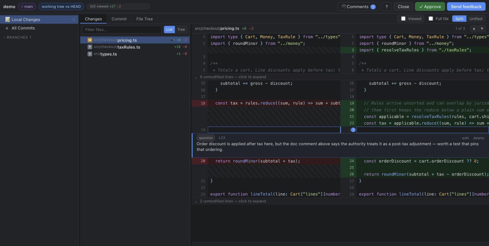
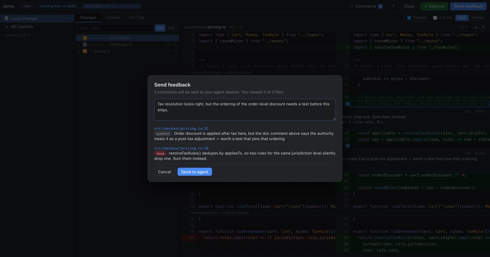
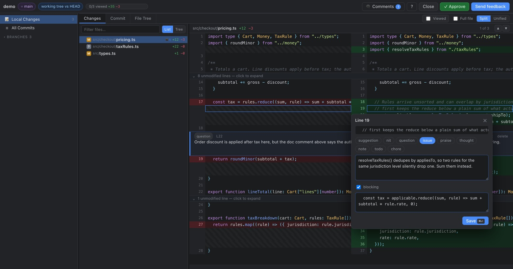
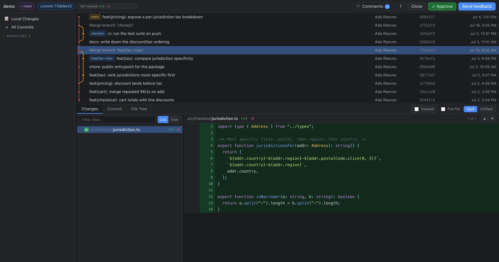

<div align="center">

# diffotator

**Fork's diff viewer, Plannotator's agent loop.**

Review your coding agent's work in a real git client — then send the comments
straight back to the agent.

[](https://diffotator.vercel.app)
[](package.json)
[](package.json)
[](#license)



</div>

## What it is

Browse commits, files and diffs like [Fork](https://git-fork.com), annotate any line,
hit **Send feedback** — the comments land in your Claude Code session as markdown the
agent acts on. Same contract as [Plannotator](https://plannotator.ai), without the lag.

- **A whole git client, not a diff blob.** Commits, branches, worktrees, stashes and
  every file at any revision — so you can comment on code the change never touched.
- **Comments are instructions.** [Conventional Comments](https://conventionalcomments.org)
  labels, a blocking flag, optional suggested code, delivered as markdown on stdout.
- **Nothing to install into your repo.** One Node process, no dependencies, no config.
  It reads git and exits when you're done.

## Install

```sh
git clone https://github.com/adisagar2003/diffotator.git
cd diffotator
ln -sf "$PWD/bin/diffotator.js" ~/.local/bin/diffotator   # needs ~/.local/bin on PATH
cp claude/diffotator.md ~/.claude/commands/diffotator.md  # the /diffotator command
diffotator hook --install                                 # optional: auto-review, below
```

No dependencies. Node 18+, git. `node test.js` runs the checks.

## Use

```sh
diffotator                       # review the working tree
diffotator --base origin/main    # review the branch against a base
diffotator -C ../other-repo
```

`--base` pins the base ref used for branch-vs-base — it reaches git, not just the
auto-detected default shown in the sidebar.

From Claude Code: `/diffotator`. The CLI blocks until you submit; whatever it prints
on stdout becomes the agent's next input.

| You do | Agent gets |
|---|---|
| **Send feedback** | `# Code review feedback` — grouped by file, blocking comments called out |
| **Approve** | `The user approved.` |
| **Close** / `Ctrl-C` | `Review session closed without feedback.` |



No PR fetching: `gh pr checkout 123` (or `glab mr checkout 123`), then
`diffotator --base origin/main`.

## Reviews that fire by themselves

A review tool you have to remember to run reviews only what you remember to review.
`diffotator hook --install` adds a `Stop` hook to `~/.claude/settings.json` (backing that
file up first), so every turn leaving real changes opens a review on its own. Blocking
comments come back as the hook's `reason`, which sends the agent back to work with the
review in hand instead of spending a fresh turn.

The whole difficulty is *not* firing. It stays quiet when the tree is clean, when the
turn touched fewer than three files, when nothing changed since the last review, and
when the harness says a hook already blocked once — so it can't loop. "Nothing changed"
is a hash of `git status` plus `git diff HEAD`, not a file list, so an edit in place
re-opens the review while one more sentence from the agent doesn't.

```sh
DIFFOTATOR_HOOK=off             # disable without uninstalling
DIFFOTATOR_HOOK_MIN_FILES=3     # fewest changed files that will open a review
DIFFOTATOR_DEBUG=1              # log why a Stop was let through
diffotator hook --uninstall     # remove it again
```

## The review loop

The Changes tab is one stream: every selected file's diff, stacked back to back
in a single scroll, GitHub's Files-changed view rather than a picker plus a pane.
Each file list row has an eye; click it shut and the file drops out of the
stream, click `all`/`none` above the list to bulk in or out, and the fold
toggle beside them collapses every file at once — then flips, editor style,
to expand them again. `v` marks the
current file viewed, collapses it in the stream, and jumps to the next unviewed
one. The header tracks `12/56 viewed +2,341 −187`, viewed files dim with a ✓,
and a sticky bar at the top of the pane doubles as that file's header — click
the path to jump to its top, the caret to fold it, the checkbox to mark it
viewed without folding. That is the whole loop for a fifty-file agent run:
`v v v`, stop when something looks wrong, `c` to comment, keep going. Once
every selected file is viewed and folded, a finish card takes the stream's
place with **Send feedback** (`⌘⏎`) or **Approve**.

Click any line number to comment. Labels follow Conventional Comments — `suggestion`,
`nit`, `question`, `issue`, `praise`, `thought`, `note`, `todo`, `chore` — plus a
blocking flag and an optional suggested-code block.



Comments render inline under the line they are about, with their label, blocking flag
and edit/delete — so re-reading a file shows what you already said. Unsent comments and
viewed state live in `~/.local/share/diffotator` and are cleared when you submit; not in
`localStorage`, which is scoped to the origin *including the port*, and every run binds
a fresh one. Closing with unsent comments asks first.

## What's in the window

Left sidebar: Local Changes, branch-vs-base (auto-detected), All Commits, worktrees,
branches, tags, stashes, remotes. Top: commit graph with lanes, refs, author, sha, date.
Bottom: **Changes** (changed files + one continuous diff stream), **Commit**
(metadata + message), **File Tree** (every file in the repo at that revision,
untracked ones included).



The changed-files pane is a flat **List** by default (reviewing is working a list)
and a **Tree** for the 12k-path repo browser; single-child directory chains fold to
one row either way, and both carry the same per-file show/hide eye for changed
files, so the stream in/out toggle works from either tab. Split or unified, word-level
intra-line diff, collapsed context you can expand, `Full file` to review a change in
its surroundings, and the File Tree tab so you can comment on code the diff never
touched.

### Keys

`j`/`k` file · `n`/`p` change · `↑`/`↓` line cursor · `c` comment · `v` viewed +
next · `s` split/unified · `f` full file · `t` comments · `/` filter files ·
`⌘F` find in file · `⌘⏎` save/send · `Esc` close

Windowing means only the visible rows exist in the DOM, so the browser's own Find
cannot see the file — `⌘F` opens ours instead.

## Why it's fast

The lag in a browser diff viewer comes from shipping the whole review as one document.
This does the opposite:

- git data is fetched per file, on demand — nothing is inlined into the page
- commit list and diff rows are windowed; only what's on screen is in the DOM
  (a 61k-line minified JSON diff opens instantly)
- fixed row heights, so windowing needs no measurement pass
- syntax highlighting runs on visible rows only, from a ~100-line regex tokenizer
  instead of a grammar bundle
- one `git diff -U1000000` per file, so expanding collapsed context is free
- rows are uniform 20px except inline comment cards, whose height is *derived*
  rather than measured, so a prefix-sum index stays exact and nothing jumps

## Not built

Staging, committing, push/pull, rebase, blame, merge conflicts, image diffs — use Fork
for those. No GitHub/GitLab PR fetching either.

## Git shapes that bite

Most diff viewers are written against a straight line of ordinary commits. These
were all real bugs here, and each one has a test:

| Shape | What went wrong |
|---|---|
| Root commit | `sha^!` has no parent to exclude — the diff came out reversed |
| Merge commit | `sha^!` excludes *every* parent, so it showed zero files |
| Rename | `numstat` compresses the path to `{old => new}` — every rename read +0/−0 |
| CRLF file | a stray `\r` rendered at the end of every line |
| Any file ending in a newline | a phantom empty last line |
| Binary | rendered as a blank pane instead of saying "binary" |
| Untracked | missing from the File Tree — exactly the files an agent just wrote |

Commits now resolve to an explicit two-dot pair against the first parent (or the
empty tree at the root), which is also what makes a merge show what it merged in.

## Links

[Docs](https://diffotator.vercel.app/docs) ·
[CLI reference](https://diffotator.vercel.app/docs#cli) ·
[GitHub](https://github.com/adisagar2003/diffotator)

## License

MIT
